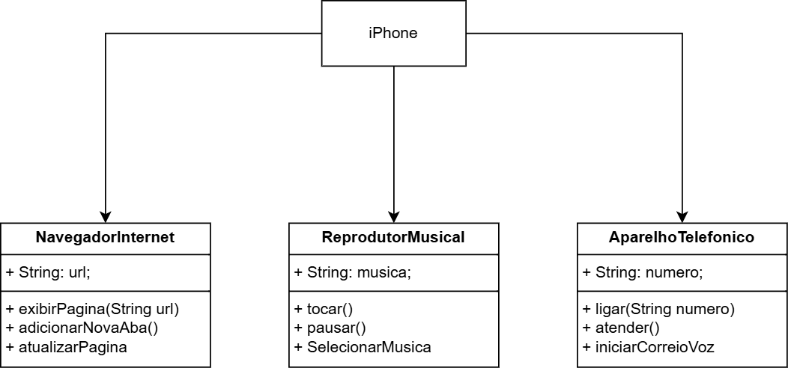

Diagrama do iphone desenvolvido por wallace Angelo durante o bootcamp da DIO.
produzido no draw.io

**Reprodutor Musical**

Métodos: tocar(), pausar(), selecionarMusica(String musica)

**Aparelho Telefônico**

Métodos: ligar(String numero), atender(), iniciarCorreioVoz()

**Navegador na Internet**

Métodos: exibirPagina(String url), adicionarNovaAba(), atualizarPagina()